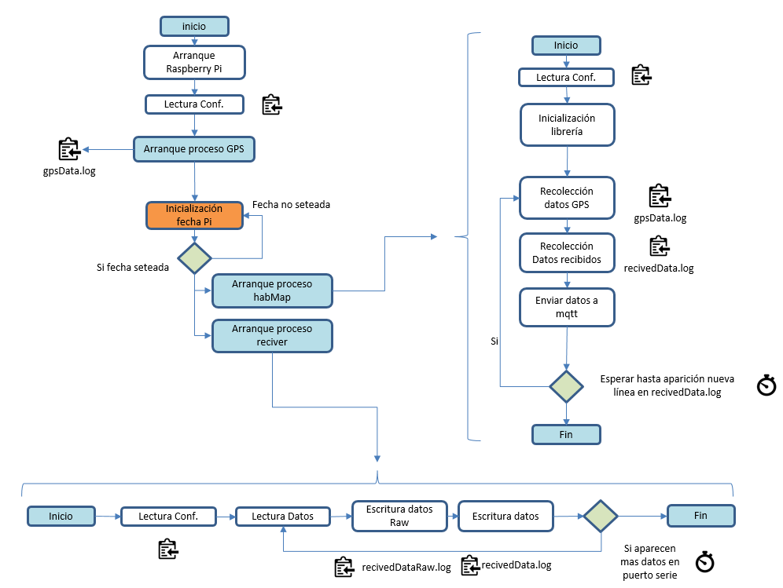

- [HAB_antena](#hab_antena)
  * [Introducción](#introducción)
  * [Diagrama de sistemas](#diagrama-de-sistemas)
  * [Getting Started](#getting-started)
  * [Configuraciones Genericas](#configuraciones-genericas)
    + [Generación de Servicios](#generación-de-servicios)
    + [Activación I2C en Raspbian](#activación-i2c-en-raspbian)
    + [Configuración USBs](#configuración-usbs)
  * [Logging](#logging)
  * [Componentes](#componentes)
    + [Servicio de Recepcion (LoRa RF)](#servicio-de-recepción-lora-rf)
      - [Introducción](#introducción-1)
      - [Descripción](#descripción)
      - [Configuración](#configuración)
    + [GPS](#gps)
      - [Introducción](#introducción-2)
      - [Descripción](#descripción-1)
      - [Conexión](#conexión)
      - [Calibrado](#calibrado)
      - [Configuración](#configuración-1)
    + [Proceso HabMap](#proceso-habmap)
      - [Introducción](#introducción-3)
      - [Descripción](#descripción-2)
      - [Configuración](#configuración-2)
    + [Servicio de Configuracion](#servicio-de-configuracion)
      - [Introducción](#introducción-4)
      - [Descripción](#descripción-3)
  * [Hardware](#hardware)
    + [Diagrama del Hardware](#diagrama-del-hardware)
    + [Bus I2C](#bus-i2c)
    + [USBs](#usbs)
    + [Listado de componentes](#listado-de-componentes)
    + [Tecnicas y procedimientos de ensamblado](#tecnicas-y-procedimientos-de-ensamblado)
  * [Anexos](#anexos)
    + [MQTTLocal](#mqttlocal)
    + [Cambiar nombre del directorio de proyecto](#cambiar-nombre-del-diretorio-de-proyecto)


# HAB_antena

Proyecto para implementar el software de captura y procesamiento de los datos enviados por una sonda HAB que emita con LoRa.

## Introducción

En este proyecto se describirán los principales componentes y software necesarios para implementar la estación terrestre (antena receptora) del proyecto [hab_sonda](https://github.com/Yggdrassil80/hab_sonda). 

## Diagrama de sistemas



## Getting Started

Este apartado está pensado para, sin tener el detalle exacto de todos los componentes y técnicas que se explican más adelante, poner en funcionamiento el software de la antena.

<b>IMPORTANTE:</b> En este tutorial se asume que se dispone de una Raspberry Pi Zero o equivalente con una versión de Raspbian (o la nueva versión Raspberry Pi OS) instalada correctamente. Si aún no se está en este punto, consultar el apartado de [Instalación Raspberry Pi OS](https://github.com/Yggdrassil80/hab_sonda/#instalación-raspberry-pi-os) y luego volver a este punto.

Los pasos son:

1. Disponer de una raspberry Pi con una versión de Raspbian (o Raspberry Pi OS) instalada y funcionando correctamente. Ejecutar antes de nada:
   ```
   sudo apt get update
   ```

2. Instalar git para poder descargar posteriormente el código de la antena
   ```
   sudo apt install git
   ```

3. Conectar todos los sistemas periféricos (Radio LoRa RF y GPS principalmente)

4. Instalar librerías de Python3 de apoyo. Las librerías de Python necesarias son las siguientes:
   * scipy
   * ...
   
   y la forma de instalarlas es mediante la instrucción:
   ```
   pip3 install [nombre_libreria]
   ```

5. Crear el directorio de trabajo ```data``` mediante las siguientes instrucciones. 

   <b>IMPORTANTE:</b> Todas las rutas de configuración estan pensadas sobre este directorio. No se recomienda cambiar a no ser que se tenga muy claro que deberá revisarse bien todo el código para reemplazar este directorio base por cualquier otro que se escoja.
   ```
   cd /
   mkdir data
   sudo chown -R pi:pi data/
   sudo chmod -R 777 data/
   ```

6. Realizar un clone del proyecto hab_antena sobre la Raspberry. El proceso es simple:
   1. Abrir una consola del SO.
   2. Posicionarse en el directorio ```/data``` (o el que se haya creado en el paso 5).
   3. Ejecutar la instrucción de clonado del repositorio "hab_antena" con el comando:
   
      ```
      git clone https://github.com/Yggdrassil80/hab_antena
      ```
      <b>IMPORTANTE</b>: Inmediatamente después de realizar esta acción, todo el código de la antena se encontrará en ```/data/hab_antena```. Esto implica que todas las configuraciones dependerán de ese path base.

7. Revisar si existe el directorio ```/data/hab_antena/logs```. Si no existe, crearlo mediante la instrucción:
   ```
   cd /data/hab_antena
   mkdir logs
   ```

8. Configurar los archivos de configuración.
   1. Configurar los sensores de la antena (LoRa RF y GPS). Para realizar esta acción se ha de configurar el archivo ```/data/hab_antena/conf/tracker.conf```. Los detalles de configuración de cada sensor se pueden consultar en la sección de configuración de cada módulo descritos en la sección [Componentes/LoRa RF](#servicio-de-recepción-lora-rf) y [Componentes/GPS](#gps).
   2. Configurar el envío de datos a un sistema externo (cola MQTT) para su seguimiento en tiempo real. Para realizar esta acción se ha de configurar el archivo ```mqttClient.yaml```. Los detalles de este archivo se encuentran en la sección [Proceso HabMap](#proceso-habmap).

9. Configurar y activar los servicios. Ver el punto [Generación de Servicios](#generación-de-servicios)

## Configuraciones Genericas

### Generación de Servicios

Como se ha indicado, la idea es que cada componente nuevo que se agrege se conciba como un servicio independiente que se ejecute en el arranque de la Raspberry Pi en un orden preestablecido y con las dependencias que se desee.

En el código descargado de Github ya se dispone de los diferentes archivos ```.service``` preparados para ser arrancados localmente. Es importante que se arranquen los servicios de este modo, ya que esto asegura que al encender la Pi, o tras su reinicio, estos servicios se activen <b>automáticamente</b>.

Para poder arrancar el servicio de un componente:

1. Se debe disponer del archivo [Nombre_modulo.service] donde se ha de describir, genéricamente, lo siguiente:

```
[Unit]
Description=[nombre_en_systemctl_del_servicio]
After=multi-user.target

[Service]
Type=idle
ExecStart=/usr/bin/python /[path_hubicación_proceso_python_arranque_servicio]/[nombre_servicio].py
Restart=always
RestartSec=0

[Install]
WantedBy=multi-user.target
```

2. Copiar el archivo del servico al directorio de systemd
```
sudo cp [nombre_servicio].service /etc/systemd/system/[nombre_servicio].service
```

3. Refrescar la lista de servicios y activar el nuevo que se desea dar de alta.
```
sudo systemctl daemon-reload
sudo systemctl enable [nombre_servicio].service
```

<b>IMPORTANTE</b>: Asegurarse que el script de python definido en el [Nombre_modulo.service] tiene permisos de ejecución (chmod 755)

4. Finalmente, para arrancar o parar el servicio una vez la el SO haya arrancado, utilizar.
```
sudo systemctl start [nombre_servicio].service

o

sudo systemctl stop [nombre_servicio].service
```

### Activación I2C en Raspbian

Los componentes que necesita la antena no requieren configuración del bus I2C.

### Configuración USBs

Todos los puertos USB, una vez conectados, están disponibles como si fueran un archivo de la Raspberry en el directorio ```/dev```. Normalmente vienen descritos como:

- ttyUSB0
- ttyUSB1
...

Para poder configurarlos en el archivo de configuración, p.e. para configurar el RF o el GPS, deberá configurarse en la variable correspondiente el path absoluto de estos archivos:

- /dev/ttyUSB0
- /dev/ttyUSB1
...

## Logging

TODO

## Componentes

### Servicio de Recepción (LoRa RF)

#### Introducción

El módulo de recepción de datos de la antena utilizará el mismo conponente utilizado para la transmisión de datos en la sonda: un Eyte E32-TTL-100 que está basado en la tecnología LoRa (Long Range) del chip SX1278 de Semtech.

Para que exista comunicación entre dos componentes de este tipo, transmisor de la sonda y receptor de la antena, es importante que ambos estén configurados en la misma frecuencia y canal. Se recomienda que los equipos encargados de la instalación y configuración de componente LoRa RF en la sonda y en la antena se pongan de acuerdo en la configuración del servicio y para hacer las pruebas de transmisión-recepción.  

El software de la antena proporciona el servicio ```reciverService```, que es el encargado de permanecer escuchando para recibir las trazas enviadas por la sonda y guardarlas en ficheros. En esta sección se explica como configurar este servicio.

#### Descripción

Este servicio basa su funcionamiento en un chip de RF Ebyte-E32-TTL-100 que viene ya preconfigurado de fábrica. Se conecta a la Raspberry a través del puerto serie y, mediante un adaptador CP2102, a un slot USB.

Dispone además de dos pines de configuración (M0 y M1) que para que pueda funcionar en modo recepción y emisión han de estar a 0V (ojo, no en Z). O sea, conectados al GND de la Pi.

Para poder configurar los parámetros internos del chip M0 y M1 han de configurarse ambos a 1 lógico (3.3V).

Toda la configuración de los parámetros LoRa del chip se basa en el parámetro de airrate, que viene a ser el ancho de banda con el que transmite el chip.

Los siguientes parámetros de configuración de LoRa son los que corresponden a cada airRate:

 - 0.3 Kbps, BW:125Mhz, SF: 12, CR: 4/5
 - 1.2 Kbps, BW:250Mhz, SF: 11, CR: 4/5
 - 2.4 Kbps, BW:500Mhz, SF: 12, CR: 4/5
 - 4.8 Kbps, BW:250Mhz, SF: 8, CR: 4/6
 - 9.6 Kbps, BW:500Mhz, SF: 8, CR: 4/6
 - 19.2 Kbps, BW:500Mhz, SF: 7, CR: 4/6

 donde,

 - BW: Significa BandWith
 - SF: Spread Factor
 - CR: Coding Rate

La frecuencia central se encuentra en los 433 Mhz. Si se desea cambiar la frecuencia de operación se puede consultar como hacerlo en el siguiente enlace [Cambio de frecuencias LoRa](https://github.com/Yggdrassil80/hab_sonda#cambio-frecuencias-lora).

El airRate por defecto es de 2.4 Kbps. Es decir, la velocidad de transferencia del chip.

El servicio de software desarrollado para este chip aisla todos estos elementos de configuración del desarrollador. 

Un aspecto interesante de este servicio es que genera dos archivos, cuyo nombre es configurable, pero inicialmente estan denominados como ```recivedData.log``` y ```recivedDataRaw.log```:
* El primero es un archivo procesado donde se garantiza que las trazas recibidas se escriben de línea en línea (incluyendo el salto de carro), de forma que el servicio de mapas pueda procesar línea a línea el archivo de forma mas eficiente.
* El segundo archivo es el ```recivedDataRaw.log```. Este archivo corresponde a la información en bruto que llega directamente desde la antena. Se almacena así por seguridad, para evitar que un posible error en el procesado de datos para la librería de mapas pueda hacer perder algún dato recibido.

#### Configuración

Existe configuración estática para este servicio en el archivo de configuración ```conf/tracker.conf```, dentro de los tags [RF] y [TCK]

En en tag [RF] se configuran las siguientes propiedades:
  ```
  usbRF=/dev/ttyUSB2
  ```
donde,

- usbRF: corresponde al puerto USB al que está conectado el adaptador CP2102 del componente de RF (Ebyte LoRa). Es importante destacar que este puerto puede cambiar en función de los dispositivos conectados a la Raspberry y el slot USB donde se conecten, con lo que se deberá comprobar manualmente que esta configuración es correcta.

En en tag [TCK] se configuran las siguientes propiedades:
```
dataPath=/data/hab_antena/logs/recivedData.log
dataPathRaw=/data/hab_antena/logs/recivedDataRaw.log
```

donde,
- dataPath: corresponde al archivo donde se dejaran los datos recibidos y preparados para ser consumidos por el servicio de mapas.
- dataPathRaw: que corresponde al archivo de datos en bruto recibidos por parte de la antena.

### GPS

#### Introducción

El GPS permite determinar la ubicación exacta de la antena. La configuración de este módulo para la antena no es imprescindible, pero otorga la posibilidad de añadir las coordenadas GPS de la antena que recibió los datos e incorporarlos en la traza capturada. Esto puede ser muy útil para determinar distancias reales de recepción o que condiciones atmosféricas alteraron o no la misma por ejemplo.

#### Descripción

El GPS sobre el cual se basado este desarrollo es el UBLOX NEO 6M que también se ha demostrado compatible con el UBLOX NEO 7.

Lo que se desea del GPS es que retorne constantemente la altura, la latitud y la longitud de la antena. Estos datos son solo unos de los pocos que se pueden extraer del GPS.

Actualmente, los chips de UBLOX operan con protocolo NMEA2.0 que se basa en la generación de una série de mensajes con datos de tiempos, velocidades, posiciones, etc.

Se puede encontrar mas información aqui: https://www.gpsinformation.org/dale/nmea.htm

Se ha desarrollado un módulo propio que interpreta los mensajes NMEA que se consideran interesantes para conocer los datos de altura, longitud y latitud de la antena (GCRMC y el GCACC).

#### Conexión 

Los chips de ublox estan configurados para empezar a volcar sus datos directamente por el puerto serie. Con un simple adaptador a USB (CP2102) se puede utilizar practicamente desde cualquier sistema operativo o plataforma que soporte USB.

#### Calibrado

Este componente no requiere ninguna acción de calibrado especial, ya que tras el encendido empieza a calcular su posición el solo. Para ganar una precisión adecuada de pocos metros, si hace mucho que no se usa, puede requerir unos minutos (5 o 10 min).

#### Configuración

A diferencia de otros componentes, los chips de UBLOX de GPS requieren de configuración inicial dependiendo de lo que se desee hacer con ellos.

En nuestro caso, nuestra aplicación implica que se alcanzaran alturas de entre 30 a 40km en el mejor de los casos, y practicamente ningun GPS convencional mide tales alturas de fabrica.

Además, existe un organismo internacional, COCOM que limita la altura a la cual estos sistemas civiles pueden operar. Nominalmente esta en 18km como maximo, pero dependendiendo del fabricante hay limites en 9 o 12km.

Superado este limite, el comportamiento del componente es diverso, en función del fabricante. En el caso de UBLOX, los datos de lat, lon y altura se quedan "congelados" hasta que se recupera una altura inferior a la del límite de configuración.

Para solventar esto, el componente de GPS desarrollado implementa una libreria especial que permite la configuración de GPS de UBLOX mediante su protocolo de comunicaciones de fabricante (UBX). Luego, cada vez que se arranca el módulo de GPS, se lanza una configuración que activa el modo "airbone<1g" que permite la operación del chip hasta alturas de 50km.

Otras configuraciones adicionales son aplicadas también, como el filtrado de paquetes de NMEA, para solo capturar los GCRMC y GCACC.

Adicionalmente, también existen configuraciones estáticas en el archivo conf/hav.conf

usbGPS=/dev/ttyUSB0
tiempoMuestreoGPS=10

donde,

- usbGPS: corresponde al puerto USB al que esta conectado el adaptador cp2102 del GPS. Es importante destacar que este puerto puede cambiar en función de los dispositivos conectados a la raspberry y el slot USB donde se conecten, con lo que se deberá comprobar manualmente que esta configuración es correcta.
- tiempoMuestreoGPS: que informa sobre el tiempo entre muestras de datos de GPS. Es importante destacar que el GPS no empieza a dar datos de posición de forma inmediata cuando arranca, sino que requeriere unos minutos de "autocalibrado" antes de empezar a recibir paquetes NMEA con datos (GCRMC y GCACC). Luego, suponiendo la configuración correcta de USB, se puede entender como normal que no haya datos de posición nada mas arrancar.

Finalmente, recordar que el uso de este módulo en la antena otorga la capacidad de disponer, en la misma traza recibida, de las coordenadas GPS + altura del HAB y de la antena a la vez, con lo que, eventualmente, se podría calcular la distancia real exacta entre antena y HAB.

### Proceso HabMap

#### Introducción

Este módulo de software es el encargado de coger los datos recibidos por la antena y enviarlos a una cola MQTT en la nube (o donde se desee). En el proceso enriquecerá los datos recibidos con un identificador de antena y la posición GPS de la misma, si este servicio estuviera configurado.

MQTT es un protocolo estándard de mensajería que se utiliza habitualmente para el envío de datos en sistemas de Internet Of Things (IoT). Los datos enviados a la cola MQTT pueden ser utilizados por otros sistemas para el procesamiento y visualización de la información en tiempo real. 

#### Descripción

Este componente basa su funcionamiento en una librería desarrollada para tal efecto que es preciso instalar.

<b>NOTA: </b> Para mas información sobre detalles de funcionamiento, instalación y configuración de esta librería se pueden encontrar aquí: https://pypi.org/project/habmapslib/ 

La instalación de la librería se efectúa mediante la siguiente instrucción:
  ```
  sudo pip3 install habmapslib
  ```

La librería está pensada para poder ser arrancada como un servicio más de Raspbian. El software de la antena proporciona un ejecutable que gobierna el servicio de arranque. Se puede ver este ejecutable en el archivo ```/data/hab_antena/habMapService.sh```.

El servicio que arranca la librería tiene un archivo ```.service``` en ```/data/hab_antena/services```, que es instalable a partir de lo explicado en los puntos superiores de este documento o bien utilizando las tools disponinbles en el directorios de /utilities.

#### Configuración

La configuración de este componente se realiza a través de un archivo de configuración adicional, que se encuentra en ```/data/hab_antena/conf/mqttClient.yaml```.

La configuración de este archivo difiere de la configuración tradicional que se puede observar en el ```tracker.conf```, donde la configuración es de tipo clave=valor. El archivo ```mqttClient.yaml``` utiliza el formato YAML, que es un estándar de representación de archivos que permite definir una jerarquía de propiedades. En el formato YAML es muy importante mantener una correcta indentación de las propiedades para definir su nivel dentro de la jerarquía.

La configuración que tiene por defecto es la siguiente:

```
basestation:
  id: "HABANTENA01"
  appenders:
    gpsappender:
      file: '/data/hab_antena/logs/gpsdata.log'
      regexselect: '\[.*\]\|(.*)\|(.*),(.*)\|.*\|'
      mapping:
        - "height"
        - "lat"
        - "lon"
mqtt:
  url: "localhost"
  topic: "hablistener"
  port: 1883
  user: "habmaps"
  password: "[consultar]"
  alive: 60
frame:
  # Definición de la trama donde
  # $time : Es la hora expresada en HHMMSS
  # $pos : Es la posición gps del hab expresada en lat,lon
  # $id  : Es el identificador del hab
  format: "$time|AlturaGPS|$pos|VelocidadHorizontalGPS|Temperatura|Presion|AlturaBarometrica|$id|"
  # Fichero donde se van insertando las trazas de LoRa
  file: "/data/hab_antena/logs/recivedData.log"
  # Cada cuantos segundos se mira el fichero de envio
  refresh: 1
```


Los campos a configurar son:
- <b>basestation.id</b>: identificador de la antena. Es una etiqueta que identificará, para cada traza recibida, que antena la ha recibido.
- <b>basestation.appender.</b>: Contiene la información necesaria para procesar la información del servicio de GPS que pudiera estar configurado en la antena. <b>No es preciso alterar esta configuración</b>
- <b>mqtt.url</b>: Su valor por defecto es localhost, pero en funcionamiento real corresponderá a la url del servidor remoto donde se encuentre la cola mqtt que almacenará los datos que se le envien desde la antena. <b> Este valor será proporcionado el dia del lanzamiento a los responsables de su configuración </b>
- <b>mqtt.topic</b>: Los servidores mqtt disponen de colas o topics donde se pueden escribir los datos y leerlos posteriormente. En el caso particular de la libreria que se ha creado, tiene el valor "hablistener" y <b>no es preciso alterarlo</b>
- <b>mqtt.port</b>: Valor por defecto del puerto donde se encuentre levantado el servidor mqtt en la nube. Su valor es "1883" y <b>no es preciso alterarlo</b>
- <b>mqtt.user</b>: Para securizar la solución de la cola mqtt y evitar que nadie mas que las antenas publiquen datos en el, se ha creado un usuario y un password para proteger la ingesta de datos. Su valor por defecto es "habmaps" pero <b>se proporcionará uno específico para el dia del lanzamiento</b>
- <b>mqtt.password</b>: Valor por defecto "[consultar]". Corresponde al password del usuario anterior.
- <b>mqtt.alive</b>: Valor por defecto "60". <b>No es necesario manipular</b>.
- <b>frame.format</b>: Este campo permite la configuración de los datos que se van a enviar a la cola mqtt para que estos puedan ser debidamente interpretados posteriormente por los componentes que generaran los mapas interactivos y los cuadros mandos. Lo que permite configurar este parámetro es el nombre de los datos que se enviaran, estos, además, <b>han de estar en el orden en el que serán recividos por la antena</b>. Adicionalmente, hay algunos de estos datos que siempre serán fijos y con el mismo nombre, de forma que exista una parte <b>variable y configurable por el usuario</b>.

Sobre la configuración de ejemplo:
```
"$time|AlturaGPS|$pos|VelocidadHorizontalGPS|Temperatura|Presion|AlturaBarometrica|$id|"
```
Los siguientes datos serán fijos, tanto en nombre, como en posición:
```
$time|AlturaGPS|$pos|VelocidadHorizontalGPS|
```
y el último valor, 
```
$id|
```

Los 4 primeros valores corresponden a la hora y coordenadas de la traza (las que envia el HAB). El último valor, $id, corresponde al identificador de la antena.

Los valores "Temperatura|Presion|AlturaBarometrica" son los que en este ejemplo, serian escogibles por el usuario para los datos que envie.

Tomando como referencia una traza tipo que pudiera llegar a la antena;

<b>110345|1234|42.453,2.3232|0.4|</b>15.7|1000.1|1123|HABCAT2|

Los valores en <b>negrita</b> corresponden a la configuración del GPS que <b>no se ha de manipular</b>.
 
Si la traza enviada por la sonda fuera otra, por ejemplo:

<b>110345|1234|42.453,2.3232|0.4|</b>15.7|1000.1|1123|3.2|0.4|HABCAT2|

La configuración del parámetro "frame.format", podría ser:

```
"$time|AlturaGPS|$pos|VelocidadHorizontalGPS|Temperatura|Presion|AlturaBarometrica|temperaturaExterna|indiceUV|$id|"
```

Como se puede observar, los datos de GPS siguen siendo los mismos y el $id igual, en ultima posición, pero habrían aparecido 2 campos mas, que representan (en el caso de este ejemplo) una temperatura y un indice de rayos UV tomado por el sensor VEML6070.

- <b>frame.file</b>: Este valor corresponde al archivo de datos procesado para que sus entradas aparezcan de una linea en una linea. Por defecto: "/data/hab_antena/logs/recivedData.log"
 - <b>frame.refresh</b>: Tiempo en segundos que el módulo comprobará si han aparecido lineas de trazas recibidas y procesadas nuevas en el archivo anterior.

<b>IMPORTANTE</b>: Para probar de forma local el envio de datos a la cola mqtt, se puede hacer una instalación local de una y configurar el mqttClient.yaml para que los datos se inyecten alli. El procedimiento de test esta descrito en este [anexo](#mqttlocal)

### Servicio de Configuracion

#### Introducción

El sistema de configuración es un módulo de soporte que se encarga de recuperar los datos de configuración del archivo de configuración que se le configure.

Ayuda a hacer mas mantenible el código y a una mejor parametrización del software.

#### Descripción

Se basa en una libreria interna de python denominada "configparser" que es capaz de leer configuraciones del tipo:

```
[nombre_seccion1]
param11=valor11
...
param1N=valor1N
....
[nombre_seccionM]
paramM1=valorM1
paramMZ=valorMX
```

Para cada nuevo parámetro que se dese añadir al archivo de configuración se ha de crear un método de lectura en este módulo.

## Hardware

### Diagrama del Hardware
TODO
### Bus I2C
TODO
### USBs
TODO
### Listado de componentes
TODO
### Tecnicas y procedimientos de ensamblado
TODO

## Anexos

### MQTTLocal

TODO

### Cambiar nombre del diretorio de proyecto

Si se deseara, se puede cambiar el nombre del diretorio de proyecto "hab_antena" por el nombre que se desee. Esto se puede hacer utilizando los comandos siguientes:
   ```
   mv -rf /data/hab_antena /data/nombre_nuevo
   ```

Para que este cambio no provoque errores de configuración, todas las referencias al directorio de configuración debería cambiar también a ```/data/nombre_nuevo```.   Esto se puede hacer utilizando el comando:

  ```
  cd /data/hab_antena
  grep -rli 'hab_antena' * | xargs -i@ sed -i 's/hab_antena/nombre_nuevo/g' @
  ```
